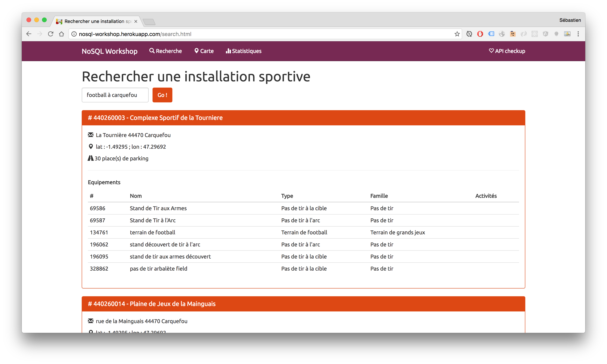
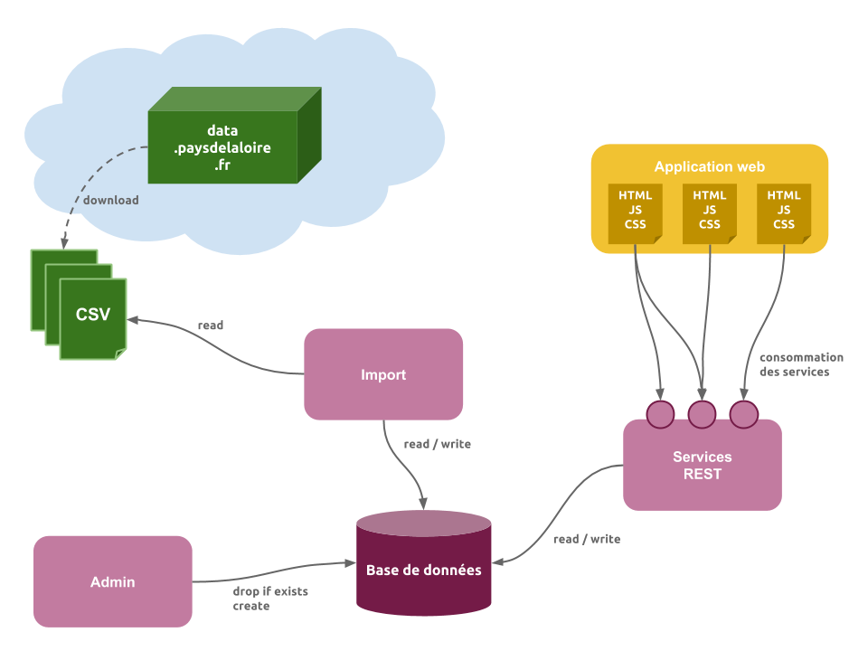
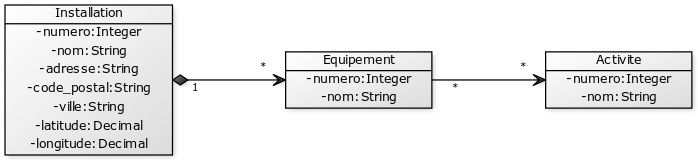
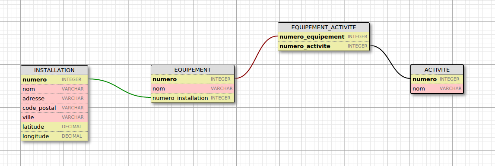

# Installations Sportives des Pays de la Loire

## Prise en main de Python

Le langage de programmation utilisé pour le projet est [Python](https://www.python.org), en version 3.

Si vous souhaitez apprendre les bases du langage, rendez-vous sur le site [Open Classrooms](http://openclassrooms.com/courses/apprenez-a-programmer-en-python) !

### Pré-requis

Vérifier votre version de Python en lançant la commande `python` ou `python3` dans un terminal :

```
$> python3
Python 3.6.0 (default, Jan 30 2017, 21:48:28)
[GCC 4.2.1 Compatible Apple LLVM 8.0.0 (clang-800.0.42.1)] on darwin
Type "help", "copyright", "credits" or "license" for more information.
>>>
```

### Exercice pour démarrer

Si vous souhaitez, vous pouvez faire un petit [exercice de prise en main](./starter) avant d'aller plus loin.

## Le projet

L'objectif est de développer une application manipulant des données relatives aux installations sportives de la région Pays de la Loire.




Les données sont issues de [http://data.paysdelaloire.fr](http://data.paysdelaloire.fr).

Trois jeux de données sont à récupérer, au format CSV :

* [Installations](http://data.paysdelaloire.fr/donnees/detail/equipements-sportifs-espaces-et-sites-de-pratiques-en-pays-de-la-loire-fiches-installations)
* [Equipements](http://data.paysdelaloire.fr/donnees/detail/equipements-sportifs-espaces-et-sites-de-pratiques-en-pays-de-la-loire-fiches-equipements)
* [Activités](http://data.paysdelaloire.fr/donnees/detail/equipements-sportifs-espaces-et-sites-de-pratiques-en-pays-de-la-loire-activites-des-fiches-equ)


### Architecture

L'application est constituée de plusieurs composants ayant chacun un rôle bien défini.

* Le composant `Admin` a pour rôle la création des tables de la base de données.
* Le composant `Import` a pour rôle le remplissage des tables de la base de données à partir des fichiers CSV.
* Le composant `Service` a pour rôle d'exposer les fonctionnalités de l'application, au travers de services REST.
* Le composant `Application web` est destiné aux internautes et a pour rôle de proposer les fonctionnalités de l'application au travers de pages web.



### Modèle de données

A partir des fichiers CSV, définissez le Modèle Conceptuel de Données (MCD) de l'application, sachant que :

* Toutes les colonnes des fichiers CSV ne vont pas forcément nous intéresser (n'utilisez que celle que vous trouvez intéressantes !)
* Des liens existent entre les trois jeux de données.

Voici une solution possible :



* Une installation possède un ou plusieurs équipements.
* Une ou plusieurs activités peuvent être pratiquées sur un équipement donné.
* Une même activité peut être pratiquée sur différents équipements.

### Import des données depuis les fichiers CSV

C'est le premier travail à réaliser :

* A partir du Modèle Conceptuel de Données, définissez le Modèle Physique de Données (MPD).
* Créez ensuite les composants `Admin` et `Import`
  * Utilisez votre base MySQL (via PhpMyAdmin) et le module `mysql.connector` ou bien [SQLite](https://www.sqlite.org/) disponible de base dans le module [`sqlite3`](https://docs.python.org/3.6/library/sqlite3.html) de Python.
  * Utilisez le module [`csv`](https://docs.python.org/3.6/library/csv.html) pour la lecture des fichiers de données.

Voici une solution possible pour le MPD :



### Services métiers

Une fois les données insérées et disponibles dans la base de données, créez un ensemble de services permettant de les exploiter.

Par exemple :

* Lister les installations sportives d'une ville donnée.
* Lister les installations (ou les équipements) où l'on peut pratiquer une activité donnée.

En vue du développement de l'application web, des services de suggestion peuvent également être développés pour :

* Suggérer des villes
* Suggérer des activités

*Un service de suggestion prend en entrée une chaîne de caractères et retourne un ensemble de libellés correspondant à cette chaîne. Par exemple, le service de suggestion des activités retournera l'ensemble ['Basket-Ball', 'Badminton', 'Baignade loisirs'] pour la chaîne 'Ba'*

#### Requêtes SQL

Avant d'écrire le code Python des services métiers, commencez par écrire et tester les requêtes SQL qui seront utilisées par les services.

Exemple de requête pour la liste des installations sportive d'une ville :

```sql
SELECT i.numero, i.nom FROM INSTALLATION i WHERE i.ville = 'Nantes'
```

Exemple de requête pour la suggestion des activités :

```sql
SELECT a.nom FROM ACTIVITE WHERE a.nom LIKE 'Ba%'
```

### Exposition d'un service REST

La librairie [Bottle](http://bottlepy.org/) permet de créer facilement des services REST.

Pour faire un premier test, téléchargez le fichier `bottle.py` et placez le dans un dossier `libs` de votre projet.

Lien vers la version 0.12.13 : [https://raw.githubusercontent.com/bottlepy/bottle/0.12.13/bottle.py](https://raw.githubusercontent.com/bottlepy/bottle/0.12.13/bottle.py)

Voici le code permettant de faire le classique Hello World (fichier `rest-example.py`	) :

```python
from libs.bottle import route, template, run

@route('/hello/<name>')
def index(name):
    return template('<b>Hello {{name}}</b>!', name=name)

run(host='localhost', port=8888)
```

Lancez ensuite le programme :

```
$> python3 rest-example.py
Bottle v0.12.13 server starting up (using WSGIRefServer())...
Listening on http://localhost:8888/
Hit Ctrl-C to quit.
```

Vous pouvez vérifier que tout va bien :

* soit via la commande `curl` : `curl -XGET http://localhost:8888/hello/world`
* soit directement dans un navigateur : http://localhost:8888/hello/world

#### JSON

Bottle permet de gérer nativement le format JSON en s'appuyant sur les dictionnaires.

Exemple :

```python
@route('/json')
def helloJson():
    return { "message" : "Hello" }
```

### Qualité des données

#### Latitudes et longitudes des installations sportives

Les latitudes et longitudes des installations sportives ne sont pas précises : elles correspondent à la ville de l'installation et non à l'adresse précise de celle-ci.

Pour améliorer cela, vous pouvez utiliser une API de **reverse geocoding** lors de l'import des données dans la base (ou bien en post traitement, comme vous préférez).

Une solution possible est [**MapQuest**](https://developer.mapquest.com/documentation/geocoding-api/).

Exemple simple d'utilisation en Python :

```python
import http.client
from urllib.parse import urlencode
import json

API_KEY = "YOUR_API_KEY"

try:
    location = input('Entrez une adresse : ')

    urlParams = {'location': location, 'key': API_KEY, 'inFormat':'kvp', 'outFormat':'json'}
    url = "/geocoding/v1/address?" + urlencode(urlParams)

    conn = http.client.HTTPConnection("www.mapquestapi.com")
    conn.request("GET", url)

    res = conn.getresponse()
    print(res.status, res.reason)

    data = res.read()
    jsonData = json.loads(data)
    # FIXME le print n'est pas très secure...
    print(jsonData['results'][0]['locations'][0]['latLng'])
except Exception as err:
    print("Unexpected error: {0}".format(err))
finally:
    conn.close()
```

Si vous rencontrez des problèmes de connexion à cause du proxy, essayez plutôt quelque chose comme cela :

```python
from urllib import request

proxy_host = 'proxyetu.iut-nantes.univ-nantes.prive:3128'
req = request.Request(url)
req.set_proxy(proxy_host, 'http')

response = request.urlopen(req)

data = response.read().decode('utf8')
```
