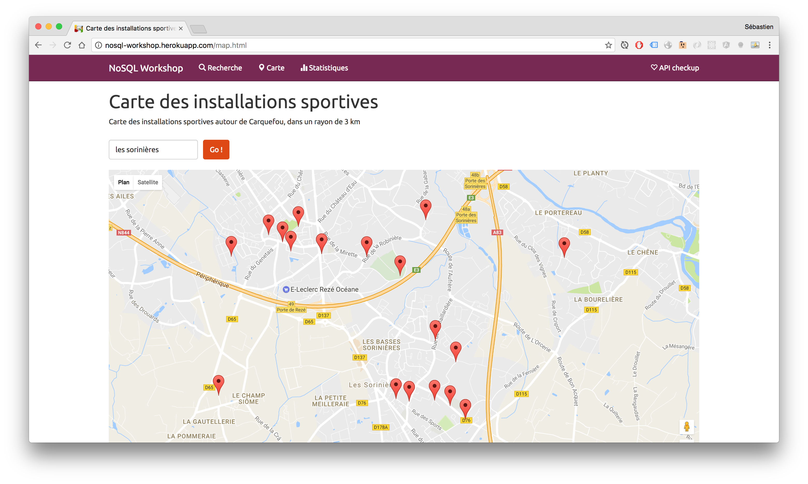

# Installations Sportives des Pays de la Loire

## Prise en main de Python

Le langage de programmation utilisé pour le projet est [Python](https://www.python.org), en version 3.

Si vous souhaitez apprendre les bases du langage, rendez-vous sur le site [Open Classrooms](http://openclassrooms.com/courses/apprenez-a-programmer-en-python) !

### Pré-requis

Vérifier votre version de Python en lançant la commande `python` ou `python3` dans un terminal :

```
$> python3
Python 3.6.0 (default, Jan 30 2017, 21:48:28)
[GCC 4.2.1 Compatible Apple LLVM 8.0.0 (clang-800.0.42.1)] on darwin
Type "help", "copyright", "credits" or "license" for more information.
>>>
```

### Exercice pour démarrer

Si vous souhaitez, vous pouvez faire un petit [exercice de prise en main](./starter) avant d'aller plus loin.

## Le projet

L'objectif est de développer une application manipulant des données relatives aux installations sportives de la région Pays de la Loire.




Les données sont issues de [http://data.paysdelaloire.fr](http://data.paysdelaloire.fr).

Trois jeux de données sont à récupérer, au format CSV :

* [Installations](http://data.paysdelaloire.fr/donnees/detail/equipements-sportifs-espaces-et-sites-de-pratiques-en-pays-de-la-loire-fiches-installations)
* [Equipements](http://data.paysdelaloire.fr/donnees/detail/equipements-sportifs-espaces-et-sites-de-pratiques-en-pays-de-la-loire-fiches-equipements)
* [Activités](http://data.paysdelaloire.fr/donnees/detail/equipements-sportifs-espaces-et-sites-de-pratiques-en-pays-de-la-loire-activites-des-fiches-equ)


### Architecture

L'application est constituée de plusieurs composants ayant chacun un rôle bien défini.

* Le composant `Admin` a pour rôle la création des tables de la base de données.
* Le composant `Import` a pour rôle le remplissage des tables de la base de données à partir des fichiers CSV.
* Le composant `Service` a pour rôle d'exposer les fonctionnalités de l'application, au travers de services REST.
* Le composant `Application web` est destiné aux internautes et a pour rôle de proposer les fonctionnalités de l'application au travers de pages web.


### Modèle de données

A partir des fichiers CSV, définissez le Modèle Conceptuel de Données (MCD) de l'application, sachant que :

* Toutes les colonnes des fichiers CSV ne vont pas forcément nous intéresser (n'utilisez que celle que vous trouvez intéressantes !)
* Des liens existent entre les trois jeux de données.

Voici une solution possible :


* Une installation possède un ou plusieurs équipements.
* Une ou plusieurs activités peuvent être pratiquées sur un équipement donné.
* Une même activité peut être pratiquée sur différents équipements.

### Import des données depuis les fichiers CSV

C'est le premier travail à réaliser :

* A partir du Modèle Conceptuel de Données, définissez le Modèle Physique de Données (MPD).
* Créez ensuite les composants `Admin` et `Import`
  * Utilisez votre base MySQL (via PhpMyAdmin) et le module `mysql.connector` ou bien [SQLite](https://www.sqlite.org/) disponible de base dans le module [`sqlite3`](https://docs.python.org/3.6/library/sqlite3.html) de Python.
  * Utilisez le module [`csv`](https://docs.python.org/3.6/library/csv.html) pour la lecture des fichiers de données.

Voici une solution possible pour le MPD :


